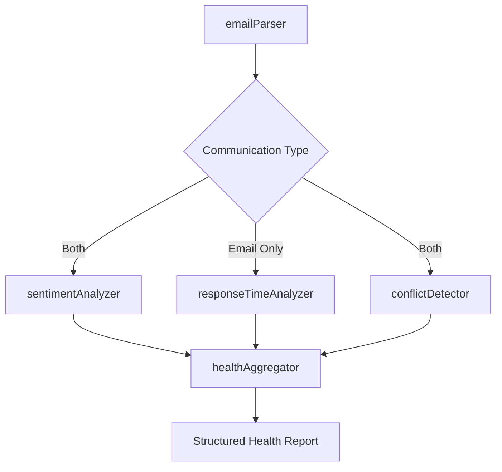

# Communication Health Analyzer

A LangGraph-powered system for analyzing communication health in email threads and meeting transcripts, providing structured insights into relationship dynamics and communication effectiveness.

## 🚀 Quick Start

### Prerequisites
- Node.js 16+ installed
- GROQ API key (free)

### Setup Instructions

1. **Clone the repository:**
   ```bash
   git clone https://github.com/roeyzeldin/communication-health-analyzer.git
   cd communication-health-analyzer
   ```

2. **Install dependencies:**
   ```bash
   npm install
   ```

3. **Get your free GROQ API key:**
   - Go to [console.groq.com](https://console.groq.com)
   - Sign up for a free account
   - Navigate to "API Keys" section
   - Create a new API key
   - Copy the key (starts with `gsk_...`)

4. **Configure environment:**
   ```bash

   # Edit .env and add your GROQ API key:
   GROQ_API_KEY=your_groq_api_key_here
   ```

5. **Start the application:**
   ```bash
   npm start
   ```

6. **Open your browser:**
   - Go to `http://localhost:3000`
   - Try the sample scenarios or paste your own email threads/meeting transcripts

## 🏗️ Graph Structure

### LangGraph Workflow Architecture

The system uses a sophisticated LangGraph workflow with **conditional routing** and **parallel processing**:



### Node Execution Flow

1. **emailParser**: Enriches raw data with metadata and parsing information
2. **Parallel Analysis** (conditional based on communication type):
   - **sentimentAnalyzer**: LLM-powered emotional analysis
   - **responseTimeAnalyzer**: Mathematical response time patterns (emails only)
   - **conflictDetector**: LLM-powered conflict and relationship analysis
3. **healthAggregator**: Combines metrics using weighted scoring and generates LLM insights with actionable recommendations

### Conditional Routing Logic

The system intelligently routes analysis based on communication type:

- **For Email Communications**: All three analysis nodes run in parallel (sentiment, response time, conflict)
- **For Meeting Transcripts**: Only sentiment and conflict analysis run (response time is irrelevant for real-time conversations)
- **For Mixed Communications**: Treats as email type and includes all analysis

This conditional routing ensures each communication type gets the most relevant analysis while avoiding unnecessary processing.

## 🎯 Modeling Approach

### Communication Health Framework

I chose a **multi-dimensional scoring model** that captures the complexity of workplace communication:

#### 1. **Emotional Health (Sentiment Analysis)**
- **Rationale**: Emotional tone fundamentally impacts communication effectiveness
- **Metrics**: Overall sentiment (0-100), emotional volatility, sentiment trends
- **LLM Role**: Detects subtle workplace emotions (concern, frustration, enthusiasm)
- **Weight**: 20% (emails), 30% (meetings)

#### 2. **Responsiveness Health (Email Only)**
- **Rationale**: Response timing patterns indicate engagement and respect levels
- **Metrics**: Average response time, timeliness patterns, urgency handling
- **Mathematical Analysis**: Calculates scores based on urgency-adjusted expectations
- **Weight**: 25% (emails only)

#### 3. **Conflict Management**
- **Rationale**: Conflict detection and escalation patterns predict relationship breakdown
- **Metrics**: Conflict level (0-10), escalation patterns, risk flags
- **LLM Role**: Identifies blame attribution, defensive language, power struggles
- **Weight**: 30% (emails), 40% (meetings)

#### 4. **Relationship Health**
- **Rationale**: Long-term relationship dynamics transcend individual messages
- **Metrics**: Trust indicators, collaboration levels, power balance
- **LLM Role**: Analyzes reciprocity, dominance patterns, communication breakdown
- **Weight**: 25% (emails), 30% (meetings)

### Why This Approach?

#### **1. Context-Aware Analysis**
Different communication mediums have different dynamics:
- **Meetings**: Real-time, collaborative, focus on interpersonal dynamics
- **Emails**: Asynchronous, formal, response timing matters significantly

#### **2. Hybrid AI/Mathematical Approach**
- **LLM Strengths**: Nuanced language understanding, context interpretation, emotional intelligence
- **Mathematical Strengths**: Objective metrics, pattern detection, quantifiable trends
- **Combined**: Rich qualitative insights with objective quantitative measures

#### **3. Weighted Scoring System**
```javascript
// Email Communications (4 metrics)
weights = {
    emotionalHealth: 0.20,      // Foundation of healthy communication
    responsivenessHealth: 0.25, // Crucial for async communication
    conflictHealth: 0.30,       // Primary risk indicator
    relationshipHealth: 0.25    // Long-term sustainability
};

// Meeting Communications (3 metrics) 
weights = {
    emotionalHealth: 0.30,      // More important in real-time
    conflictHealth: 0.40,       // Critical in face-to-face dynamics
    relationshipHealth: 0.30    // Collaboration focus
};
```

#### **4. Multi-Stage LLM Integration**
- **Stage 1**: Sentiment analysis with emotion detection
- **Stage 2**: Conflict analysis with relationship dynamics
- **Stage 3**: Insight generation with actionable recommendations

### Design Decisions

#### **Why LangGraph?**
- **Conditional Logic**: Different analysis paths for different communication types
- **Parallel Processing**: Independent analysis nodes can run concurrently
- **State Management**: Clean separation of concerns with proper channel ownership
- **Scalability**: Easy to add new analysis dimensions without affecting existing nodes

#### **Why Multi-Dimensional Scoring?**
Communication health isn't unidimensional. A conversation can have:
- High sentiment but poor responsiveness
- Good conflict management but low emotional intelligence
- Strong relationships but declining engagement patterns

#### **Why Context-Aware Weighting?**
- **Meetings**: Responsiveness is irrelevant; focus on real-time dynamics
- **Emails**: Timing patterns are crucial communication health indicators
- **Adaptive**: Weights adjust automatically based on communication type

## 🔄 LLM Prompt Engineering Strategy

### 1. **System Message Specialization**
Each analysis node has specialized system messages:
- **Sentiment**: "Expert emotional intelligence analyst"
- **Conflict**: "Professional communication analyst and conflict resolution expert"
- **Insights**: "Senior organizational psychologist"

### 2. **Structured JSON Output**
All LLM calls use strict JSON schemas with:
- Numerical scores for quantitative analysis
- Categorical classifications for pattern recognition
- Array structures for detailed breakdowns

### 3. **Context-Rich Prompts**
- Include participant information and communication type
- Provide sentiment context to conflict analysis
- Use workplace-specific language and scenarios

## 📊 Output Structure

```json
{
  "conversationId": "conv-001",
  "type": "email",
  "overallScore": 75,
  "status": "good",
  "breakdown": {
    "emotionalHealth": {"score": 80, "weight": 0.20},
    "responsivenessHealth": {"score": 85, "weight": 0.25},
    "conflictHealth": {"score": 70, "weight": 0.30},
    "relationshipHealth": {"score": 75, "weight": 0.25}
  },
  "insights": {
    "summary": "Communication shows positive collaboration with minor tension points...",
    "strengths": ["Clear communication style", "Timely responses"],
    "concerns": ["Occasional defensive language", "Power imbalance emerging"],
    "recommendations": [
      {
        "priority": "medium",
        "category": "conflict_resolution", 
        "action": "Schedule alignment meeting to address scope concerns",
        "expectedImpact": "+5-8 points improvement expected"
      }
    ]
  },
  "alerts": [],
  "analysisMetadata": {
    "analyzedAt": "2024-01-16T10:30:00Z",
    "processingTimeMs": 2450,
    "confidenceScore": 0.85
  }
}
```

## 🎯 Value Proposition

This approach provides:
1. **Objective Insights**: Data-driven health scores with clear methodology
2. **Actionable Recommendations**: Specific, prioritized improvement suggestions  
3. **Early Warning System**: Conflict detection before escalation
4. **Contextual Analysis**: Appropriate metrics for different communication types
5. **Scalable Framework**: Easy to extend with new metrics or communication channels

The system transforms subjective "relationship health" into measurable, actionable intelligence for improving workplace communication effectiveness.